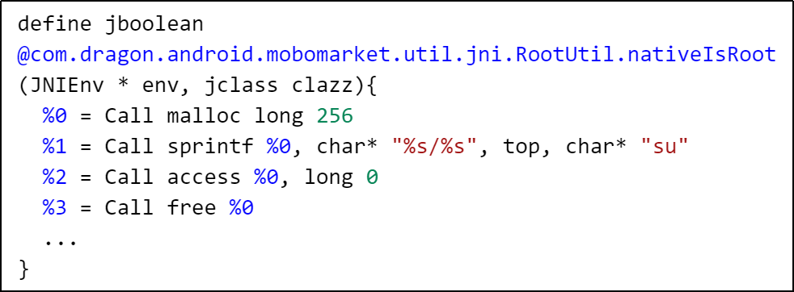
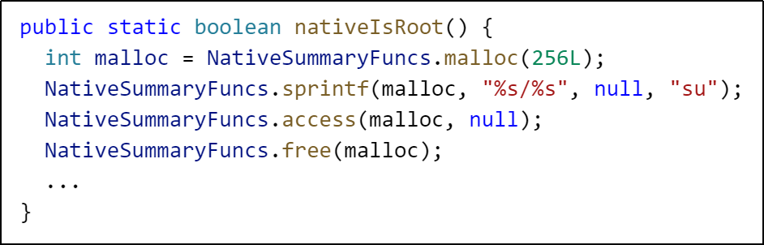
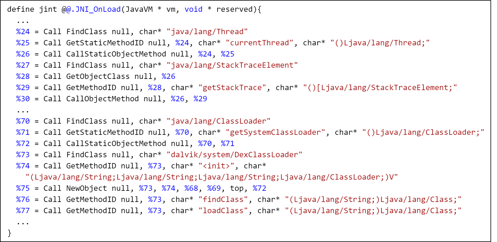
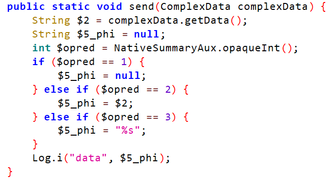
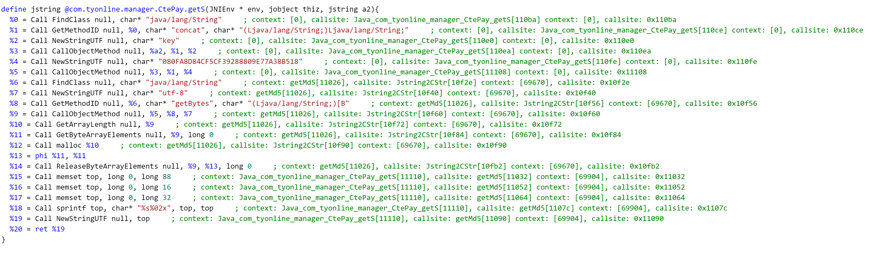
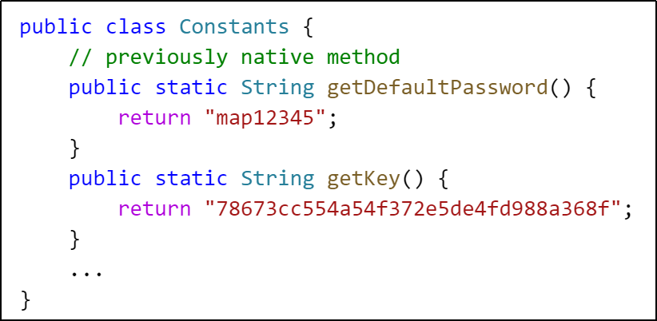

# NativeSummary

A new inter-language Android application static analysis framework using static analysis (based on BinAbsInspector) instead of symbolic execution to make binary code analysis more efficient. To make binary analysis results more generic, we translate the semantic summary extracted from binary code to java bytecode, inject the generated method body into the corresponding native method on the java side, and repack it as a new apk file.

## Docker images for android native code taint analysis tools

the docker images is publicly available at https://hub.docker.com/u/nativesummary

- NativeSummary [Docker Image](https://hub.docker.com/r/nativesummary/nativesummary) [Source](https://github.com/NativeSummary/NativeSummary)
- JN-SAF [Docker Image](https://hub.docker.com/r/nativesummary/jnsaf) [Modified Source](https://github.com/NativeSummary/Argus-SAF)
- Jucify [Docker Image](https://hub.docker.com/r/nativesummary/jucify) [Modified Source](https://github.com/NativeSummary/JuCify)


## Introduction

NativeSummary is capable of discovering behaviors in native code of android apps.

**Root Detection**: searching for "su" executable in native code:





**Stack Trace Detection**: get stack trace in native code:



NativeSummary is also capable of lift some native code behaviors to bytecode level:

**dataflow**



**return string constants**





### Quick Start

mount apk or a folder containing apk files as /apk. create a output folder and mount to `/out`. (the repacked apk is under `/out/repacked_apks/`)

Two different way to use this docker container:
1. analyze single apk file: (recommended)
    ```bash
    docker run --rm -it -v /dataset/nfbe/native_handle-release-unsigned.apk:/apk -v /nfbe-results/native_handle-release-unsigned.apk:/out nativesummary/nativesummary
    ```
1. analyze apk files in a folder
    ```bash
    docker run --rm -it -v /dataset/nfbe:/apk -v /nfbe-results:/out nativesummary/nativesummary
    ```

**Envrionment Variables**
- use `NS_TIMEOUT` to limit the running time of the whole analysis. the value is directly passed to [`timeout`](https://man7.org/linux/man-pages/man1/timeout.1.html). for example: `NS_TIMEOUT=2h`
- use `GHIDRA_NS_ARGS` env variable to pass arguments to ghidra scripts.
    - To set timout for each analyzed native method: `-e GHIDRA_NS_ARGS="@@-timeout 1000"`
- use `NS_PREFER_32=True` to prefer 32-bit arm binary.
- use `NS_SELECT_ARCH` to directly select an arch. (must in ['arm64-v8a', 'armeabi-v7a', 'armeabi'])


**Result Layout**(folder mode)
- `/out/repacked_apks` repackaged apk files.
- `/out/repacked_apks/xxx.apk.sinks.txt` generated native specific sinks.
- `/out/xxxx.native_summary/xxx.so.summary.ir.ll` human-readable SummaryIR
- `/out/xxxx.native_summary/xxx.so.summary.java_serialize` serialized SummaryIR java object
- `/out/xxxx.native_summary/project` ghidra project
- `/out/xxxx.native_summary/xxx.so.funcs.json` JNI binding info (without dynamic registration)
- `/out/xxxx.native_summary/xxx.so.log` binary analysis log file.
- `/out/xxxx.native_summary/xxx.so.perf.json` binary analysis statistics(coverage, time ...)
- `/out/xxxx.native_summary/xxx.so.txt` binary analysis running time.
- `/out/xxxx.native_summary/02-built-bodies.jimple` jimple body built for native methods.

## projects layout

main projects layout for this organization account:

- native_summary_bai/pre_analysis: preanalysis module.
    - requires platforms folder
- native_summary_bai: binary analysis module based on BinAbsInspector
    - uses NativeSummaryIR
- native_summary_java: Generate body for native methods in APK.
    - uses NativeSummaryIR
    - requires platforms folder

## Development - build docker image

- recursive clone this project. 
    - `git clone`
    - `git submodule update --init --recursive`
- build native_summary_bai and build native_summary_java.
- download `ghidra_10.1.2_PUBLIC_20220125.zip` here
- run `copy-release.sh` to copy build artifacts to `./root` directory
- build docker image

```bash
docker build . --tag ns --build-arg UBUNTU_MIRROR=mirrors.ustc.edu.cn --build-arg PYTHON_MIRROR=pypi.tuna.tsinghua.edu.cn
```

to move image to another machine, first export image to a tar file using `docker save ns -o ns.tar`, then import using `docker load -i ns.tar`
